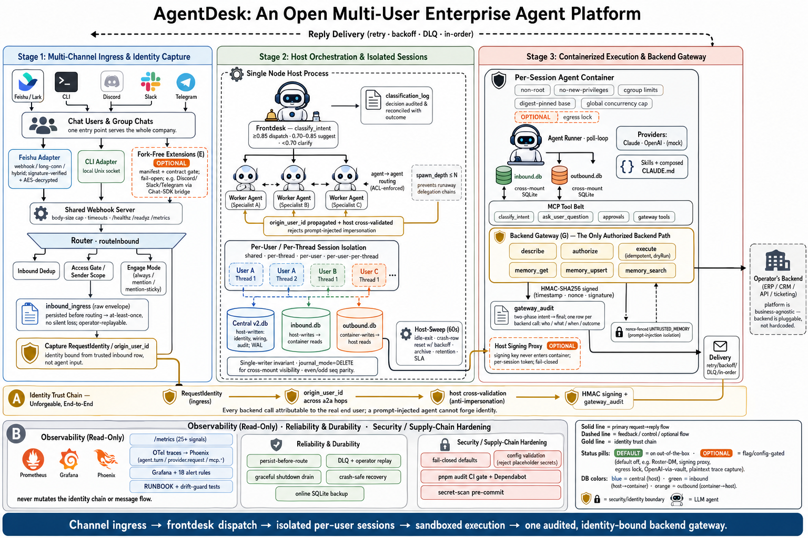

# AgentDesk Agent Platform — 平台介绍

这是一份从零开始的平台导览。读完应该知道：AgentDesk 是什么、解决了什么问题、各个模块怎么协作、生产部署需要注意什么、深入哪个细节去哪查。

> **品牌可配置。** 默认显示名是 `AgentDesk`，机器命名空间是 `agentdesk`（可通过 `BRAND_NAME` / `BRAND_NAMESPACE` 改写）。本文用默认值书写。

<p align="center">
  
</p>

<p align="center"><sub>通道接入 → frontdesk 派活 → 按用户隔离的会话 → 沙箱化执行 → 唯一的、带审计与身份绑定的后端网关</sub></p>

文档分四层：

1. [README.md](../README.md) — 一页能力清单 + 快速启动
2. **本文（PLATFORM.md）** — 系统总览 + 导航
3. `docs/<topic>.md` — 专题文档（架构、DB、隔离模型、Feishu、后端网关等）
4. 代码顶端的 block comment — 单文件级别的 invariants 和取舍说明

---

## 1. 这是什么

**AgentDesk 是一个面向企业的多用户 AI agent 基础设施。**

主链路：

```
飞书消息  →  frontdesk agent（前台分流）
              →  worker agent（业务专家）
                    →  后端网关（你的后端）
                          →  ERP / 审批 / 权限系统
```

跟普通"飞书机器人"的区别：

| 关注点 | 普通机器人 | AgentDesk |
|---|---|---|
| 多人共用 | 一个 bot 一个 prompt | 不同员工**完全隔离**的 session |
| 身份 | bot 账号代表所有用户 | 每次后端调用归属到**真实员工**，不可被 prompt-injection 伪造 |
| 派活 | 单一 agent 全包 | frontdesk 分流 → 专项 worker，链路上身份不漂 |
| 审计 | 没有 / 靠对话日志 | 中央 `gateway_audit` 表，每次调用一行（who / what / when / 结果） |
| 容器 | 不存在 | 每个 session 独立容器，cgroup 资源限制，并发上限 |
| 观测 | 无 | Prometheus `/metrics`：路由时延、容器退出分类、分类决策、后端调用错误 |

适合的部署形态：**1 个 host + Docker（或 Apple Container）+ 飞书 + 一个企业自己的后端**（ERP / CRM / 工单系统等）。规模目标：1000 员工量级。

---

## 2. 顶层架构

### 2.1 进程拓扑

```
┌─────────────────────────────────────────────────────────────────────────┐
│ Host 进程（Node + pnpm，单进程）                                         │
│                                                                         │
│  router.ts ──► session-manager.ts ──► container-runner.ts               │
│       │                  │                   │                          │
│       ▼                  ▼                   ▼                          │
│   webhook 接入     resolveSession         spawn / wake                  │
│   (Feishu / CLI)   读 central DB          spawn 容器                    │
│                    定位 inbound.db                                      │
│                                                                         │
│  delivery.ts （1s active poll + 60s sweep poll）                        │
│       │                                                                 │
│       └─► reads outbound.db, dispatches replies + system actions        │
│                                                                         │
│  host-sweep.ts （60s，所有 active session）                              │
│       └─► heartbeat / claim 检查、容器 stuck 检测、session 归档         │
│                                                                         │
└──────────────────────────┬──────────────────────────────────────────────┘
                           │ 文件挂载
            ┌──────────────┼──────────────┐
            ▼              ▼              ▼
    Container A     Container B     Container N
    (Bun runtime,   ...             ...
     1 session)
       │
       ├── poll-loop.ts （每 1s 读 inbound.db）
       ├── 调 provider（Claude / OpenAI compatible）
       ├── 调 MCP 工具（send_message, classify_intent, gateway_*, etc.）
       └── 写 outbound.db
```

### 2.2 三个数据库

```
┌───────────────────────────────────────────────────────┐
│ Central DB    data/v2.db                              │
│ ─────────────────────────────────────────────────     │
│ 写者: host                                            │
│ 内容: agent_groups / messaging_groups / sessions /    │
│       users / user_roles / agent_destinations /       │
│       gateway_audit / classification_log /            │
│       enterprise_audit / inbound_dedup / etc.         │
└───────────────────────────────────────────────────────┘

每个 session（data/v2-sessions/<agent_group_id>/<session_id>/）：

┌───────────────────────────────┐  ┌───────────────────────────────┐
│ inbound.db                    │  │ outbound.db                   │
│ ─────────────────             │  │ ─────────────────             │
│ 写者: host                    │  │ 写者: container               │
│ 读者: container（挂载只读）   │  │ 读者: host（轮询只读）        │
│ messages_in / destinations /  │  │ messages_out / processing_ack/│
│ session_routing / ...         │  │ session_state / ...           │
└───────────────────────────────┘  └───────────────────────────────┘

不变式: 每个文件恰好一个写者，DELETE journal mode（虚拟化挂载下 WAL 不可靠）
```

详细 schema：
- [docs/db.md](db.md) — 三库总览 + 跨挂载不变式
- [docs/db-central.md](db-central.md) — Central DB 表逐个解释
- [docs/db-session.md](db-session.md) — 两文件 session 表 + seq 奇偶约定

### 2.3 实体模型

```
users (id="<channel>:<handle>", kind, display_name)
   │
   ├─► user_roles (owner | admin[全局/按组] | org-admin | operator | viewer)  ← RBAC, ADR-0051
   │       每行恰一个 scope 轴: global | agent_group_id | organization_id
   │
   ├─► agent_group_members (无特权访问门 + 名义"参加哪些组")
   │
   └─► organization_members (可达性,非特权 — 多租户隔离前置条件, ADR-0052)

organizations (租户边界, ADR-0052)
   ▲ organization_id (可空; NULL = 未分租户 = 原 RBAC,逐字兼容)
   │
agent_groups ─┘                                             ┐
  ├─ workspace                                              │
  ├─ container.json (memoryMb, cpus, MCP servers, ...)      │ 多对多
  ├─ CLAUDE.md (per-group system prompt)                    │
  └─ skills/                                                │
                                                            │
messaging_groups                                            │
  └─ 一个 chat / 一个 platform                              ┘
                       ↑
                       │ via messaging_group_agents (engage_mode, session_mode, ...)

sessions = (agent_group, messaging_group, owner_user, thread_id) → 一个容器
（org 不直接挂 session / messaging_group,经不可变的 agent_group_id JOIN 推导）
```

详见 [docs/isolation-model.md](isolation-model.md)（4 种 session 隔离模式 + org 多租户隔离层 ADR-0052）。

---

## 3. 一条消息的生命周期

跟着 Alice 在飞书 @ 机器人发"帮我看一下昨天 INV-001 的审批状态"走一遍：

### 步骤 1: 入站

1. 飞书 webhook（或 long-connection）→ `src/channels/feishu.ts` 解码 + 验签 + 解密
2. `markInboundSeen(channel, eventId)` 入库去重（飞书 at-least-once）
3. 产出 `InboundEvent`，调 `routeInbound(event)`

### 步骤 2: 路由

4. `src/router.ts`：根据 `(channelType, platformId)` 找 messaging group
5. 跑 `senderResolver`（permissions 模块注入）→ `users` 表 upsert
6. fan-out：每个 wired agent 跑 `evaluateEngage`（trigger 规则）+ `accessGate`（权限门）
7. `resolveSession(agent_group, messaging_group, thread_id, owner_user_id, root_session_id)` → session row（已存在或新建）
8. `writeSessionMessage` 写到该 session 的 `inbound.db`，行带 `origin_user_id`（host 只信任 session 派生身份，不信 agent 自报）

### 步骤 3: 唤醒容器

9. `wakeContainer(session)`：检查 `MAX_CONCURRENT_CONTAINERS`，检查 in-flight 去重，spawn `docker run`（或 reuse 已活的）
10. 容器挂载该 session 的 inbound.db（只读）+ outbound.db + workspace
11. `--memory / --cpus / --pids-limit` 从 `container.json.resources` 注入
12. OneCLI gateway 注入凭证（per-agent secret 注入到 HTTP 代理）

### 步骤 4: 容器执行

13. `container/agent-runner/src/poll-loop.ts` 每 1s 读 inbound.db
14. **batch-split**：如果同 tick 拿到多用户/多线程消息，拆分。当前 turn 只处理 anchor 组，其他释放 claim 留给下一 tick
15. 解析 anchor → `RequestIdentity` 设置（trusted session 来源 → 后端调用归属正确员工）
16. 调 provider（Claude / OpenAI），LLM 产出
17. 期间 LLM 可能调 MCP tool：
    - `classify_intent` 必须先调（声明分类，写 system message → host classification_log 表）
    - `send_message` / `send_file` / `<message to="worker">` 派活
    - `gateway_authorize` / `gateway_execute` / `gateway_memory_*` 调你的后端网关
18. 所有 outbound 写到 outbound.db

### 步骤 5: 投递

19. `src/delivery.ts`（1s active + 60s sweep）轮询 outbound.db
20. **system kind** 走 delivery action 注册表（schedule_task / gateway_audit / classify_intent / provider_error 等）
21. **agent kind**（a2a 派活）→ `routeAgentMessage` → 写到 worker session 的 inbound.db，带 `origin_user_id` 跨 hop 传递
22. **chat kind**（普通回复）→ adapter.deliver(...) 经飞书 SDK 发出去
23. 期间 reconcileClassification 把 `_classificationId` 链回 classification_log.outcome_ref，**bypass / mismatch 写到指标**

### 步骤 6: 闭环

24. host 写 `delivered` 行（防重）
25. host 把分类决策、后端调用都落了 audit 表
26. Prometheus `/metrics` 反映了一切

---

## 4. 关键机制（解决了什么硬问题）

### 4.1 身份 / 信任链

**问题**：多用户共用 frontdesk 时，prompt-injected agent 可以"我以 CEO 身份发起这次操作"。

**解法（5 层叠加）**：

| 层 | 机制 | 作用 |
|---|---|---|
| 1 | host 写 inbound.db 时 stamp 真实 senderId | container 无法伪造来源 |
| 2 | container 启动时 host 把 user 身份写 origin_user_id 列 | 跨 a2a hop 传递的根身份 |
| 3 | poll-loop 在 turn 开始时 `setRequestIdentity` | 一个 turn 内身份不漂 |
| 4 | tool handler 不读 agent args，读 RequestIdentity | LLM 自报的 userId 被忽略 |
| 5 | 多用户混批 → batch-split | 一个 tick 多人消息会被拆到不同 turn |

后端网关收到的请求带 `requesterSource: 'session' \| 'agent-asserted'` —— 后者是更弱信号（无可信来源），后端可对其拒绝写操作。

**深入**：[docs/architecture.md "Identity Model"](architecture.md) + `container/agent-runner/src/request-identity.ts` + `request-context.ts`。

### 4.2 派活和分类（classify_intent 协议）

**问题**：frontdesk 用 prompt 默默分类，没办法做 regression、没办法看路由分布。

**解法**：每次派活前必须先调 `classify_intent` 工具，参数：
- `recommendedWorker`（必须是真实 destination）
- `confidence` 0-1
- `candidates[]`（其他考虑过的）
- `reasoning`（一两句话）
- `action`：`delegate` / `clarify` / `reject` / `answer_self`

工具返回 advisory（"confidence < 0.70 必须先 clarify"）+ classificationId。后续 outbound 自动 stamp 该 id。

host 把 classification_log 表 + outcome_ref 闭环 + 4 类 bypass 指标都做了：
- `no_classification_id`：没调工具直派
- `classification_not_found`：id 不存在 / 跨 session
- `action_mismatch`：声明 delegate 实际发 channel reply（不让用户回复抢占真派活的 outcome_ref slot）

**深入**：`container/agent-runner/src/mcp-tools/classify-intent.ts` + `src/modules/classification-log/index.ts` + `src/db/migrations/023-classification-log.ts`。

### 4.3 容器生命周期和资源安全

| 问题 | 解法 |
|---|---|
| 一个容器死循环吃光 host | per-group `resources.{memoryMb, cpus, pidsLimit}` → docker run 标志 |
| 入站 burst 一次拉 N 个容器，host 撑不住 | `MAX_CONCURRENT_CONTAINERS=10`，超出立刻返回 false，host-sweep 60s 后重试 |
| 闲置容器持续吃内存 | `AGENTDESK_IDLE_EXIT_MS=120000`，2 分钟空闲容器主动退（同用户连发还是用 hot 容器） |
| 容器卡死无心跳 | host-sweep 心跳 mtime + 30 分钟绝对上限，过期 SIGKILL |
| 容器异常退出，处理中消息丢失 | container_state.processing_ack 表，host 回收时把消息标记为 retry |

**深入**：[docs/architecture.md "Container Properties"](architecture.md) + `src/host-sweep.ts:decideStuckAction()` + `src/container-runner.ts`。

### 4.4 Session 生命周期

```
状态机：active → archived → (hard-deleted)
        │            │            │
        │            │            └─ AGENTDESK_ARCHIVE_HARD_DELETE_DAYS 后
        │            └─ tar 到 data/v2-sessions-archive/，DB 行留作审计
        └─ AGENTDESK_SESSION_TTL_DAYS 天空闲后 archive
```

archive / hard-delete 都有独立 archived_at 列，hard-delete 按归档时间算（不会归档当天就被删）。tar 用 child_process.spawn 异步，sweep 不会阻塞。

**深入**：`src/session-archive.ts` + migration 021 / 022。

### 4.5 安全和审计

| 通道 | 保护 |
|---|---|
| Feishu webhook | AES-256-CBC 解密 + SHA-256 时间戳签名（`src/channels/feishu/primitives.ts`） |
| Container ↔ 后端网关 | 可选 HMAC-SHA256：`x-agentdesk-{timestamp,nonce,signature}`（header 前缀随 `BRAND_NAMESPACE` 变化，共享 signingKey） |
| OneCLI gateway | 凭证不进容器，HTTP 代理动态注入，per-agent secret 隔离 |
| 入站去重 | `inbound_dedup(channel, event_id)` 24h TTL |
| 审计表 | `gateway_audit`：每次后端调用（成功/失败）一行 |
| 审计表 | `classification_log`：每次分类决策一行 |
| 审计表 | `enterprise_audit`：autowire 降级、policy override 等 |

**深入**：[docs/enterprise-erp-gateway.md](enterprise-erp-gateway.md) 完整协议。

---

## 5. 业务能力（开箱即用）

### 5.1 频道接入

| Channel | 状态 |
|---|---|
| `feishu` | 内置（webhook / long-connection / hybrid 三模式） |
| `cli` | 内置（本地调试用） |

要接其他平台（Slack / WhatsApp / Telegram）需自己写 adapter，参考 `src/channels/feishu.ts`。Channel 协议在 [docs/api-details.md](api-details.md)。

### 5.2 后端网关 MCP 工具

`backendGateway.baseUrl` 配置后容器自动获得：
- `gateway_describe` — 列后端能力 / 操作清单
- `gateway_authorize` — 操作前置鉴权
- `gateway_execute` — 执行业务操作
- `gateway_memory_get` / `gateway_memory_upsert` — durable memory（user.profile / user.preferences / approval.history）
- `gateway_memory_search` — 长期记忆检索 + 来源 provenance + 召回内容注入隔离（ADR-0033；后端未实现时返回 404，平台降级为 `OPERATION_NOT_FOUND`）

请求 envelope（强制字段）：
```json
{
  "contractVersion": 1,
  "agent": { "agentGroupId", "groupName", "assistantName" },
  "requester": { "userId", "channelType", "platformId", "threadId" },
  "requesterSource": "session" | "agent-asserted",
  "operation": "...",
  "input": {},
  "context": {},
  "dryRun": false,
  "idempotencyKey": null
}
```

契约的**唯一真相源**是 zod schema `container/agent-runner/src/mcp-tools/gateway-contract.ts`（散文约定已硬化为可验证契约，ADR-0028）。

**深入**：[docs/enterprise-erp-gateway.md](enterprise-erp-gateway.md) 包含 HMAC 协议、PII 建议、operation 命名规范、memory 模型、conformance 自测脚本。可运行参考实现见 [`examples/reference-gateway/`](../examples/reference-gateway/)。

### 5.3 Worker 拓扑

`pnpm init:enterprise` 默认只建**一个空白模板 frontdesk**（`agentdesk-frontdesk`），不含任何业务 worker。需要 worker 时通过 `--workers` 传名字，例如：

| folder（示例） | 业务定位 |
|---|---|
| `agentdesk-frontdesk` | 接待 / 分流 / 派活（默认创建） |
| `agentdesk-access-worker` | 身份 / 权限 / SSO 映射 |
| `agentdesk-sales-worker` | 销售相关后端操作 |
| `agentdesk-finance-worker` | 财务 / 发票 / 审批 |
| `agentdesk-approval-worker` | 通用审批流 |
| `agentdesk-ops-worker` | 运维 / 通知 |

上表 worker 只是名字示例，不是默认拓扑。Worker 列表是配置（`--workers` CLI 参数），不是硬编码业务范围。每个 worker 独立 system prompt + container.json + 资源配额。

---

## 6. 部署

> 全部环境变量的权威清单见仓库根 [`.env.example`](../.env.example)（按功能分组，每项标注必填性、默认值、安全后果）。`cp .env.example .env` 后填值即可。启动期会做保守的配置校验并拒绝占位密钥（ADR-0025）：只在功能被启用时才要求其必填项，未启用的功能与未设置的可选项不受影响。

### 6.1 最小可用配置

```bash
# 飞书
FEISHU_APP_ID=cli_xxx
FEISHU_APP_SECRET=xxx
FEISHU_EVENT_MODE=hybrid           # webhook / long-connection / hybrid
FEISHU_BOT_OPEN_ID=ou_xxx
# webhook 模式额外:
FEISHU_ENCRYPT_KEY=xxx
FEISHU_VERIFICATION_TOKEN=xxx
WEBHOOK_PORT=3000

# Provider
OPENAI_BASE_URL=https://your-llm-gateway
OPENAI_API_KEY=sk-xxx
OPENAI_MODEL=gpt-5.4

# Enterprise autowire
ENTERPRISE_FRONTDESK_FOLDER=agentdesk-frontdesk
ENTERPRISE_AUTO_WIRE_CHANNELS=feishu
ENTERPRISE_AUTO_WIRE_P2P=true

# 容量保护（强烈推荐生产开启）
MAX_CONCURRENT_CONTAINERS=10
AGENTDESK_IDLE_EXIT_MS=120000
AGENTDESK_SESSION_TTL_DAYS=30
```

```bash
pnpm install
pnpm container:build              # 构建 agent 基础镜像（首次部署必须；BRAND_NAMESPACE 或路径变更后需重建）
pnpm init:enterprise              # 创建一个空白模板 frontdesk（带默认资源限制）
pnpm configure:enterprise-gateway --base-url https://your-gateway.example.com/api/agent
pnpm dev                          # 开发模式 / 或 pnpm build && pnpm start
```

### 6.2 环境变量速查

| 变量 | 默认 | 作用 |
|---|---|---|
| `MAX_CONCURRENT_CONTAINERS` | 10 | 全局并发容器上限 |
| `DELIVERY_TIMEOUT_MS` | 30000 | 单次渠道 adapter 投递调用超时；超时计为失败并按退避重试（ADR-0016） |
| `DELIVERY_CONCURRENCY` | 4 | 投递轮询跨 session 并发度（session 内仍严格串行） |
| `AGENTDESK_IDLE_EXIT_MS` | 0（关） | 容器空闲多久主动退 |
| `AGENTDESK_SESSION_TTL_DAYS` | 0（关） | 多少天空闲 session 归档 |
| `AGENTDESK_ARCHIVE_HARD_DELETE_DAYS` | 0（关） | 归档多少天后物理删除 |
| `AGENTDESK_PROGRESS_STATUS_CHANNELS` | feishu | 哪些通道启用 reaction 进度提示 |
| `ENTERPRISE_AUTO_WIRE_ALLOW_POLICY_DOWNGRADE` | true | autowire 是否允许降级 unknown_sender_policy |
| `ENTERPRISE_AUTO_WIRE_P2P` | false | 飞书 P2P 自动接线 |
| `ENTERPRISE_AUTO_WIRE_GROUPS` | false | 飞书群聊自动接线 |
| `WEBHOOK_PORT` | 3000 | webhook + `/metrics` + `/healthz` + `/readyz` 暴露的端口 |
| `WEBHOOK_MAX_BODY_BYTES` | 1048576（1 MiB） | ingress 请求体上限；超限返回 413 并计入 `webhook_rejected_total{reason="body_too_large"}`（ADR-0020） |
| `WEBHOOK_REQUEST_TIMEOUT_MS` | 30000 | 单次请求完整生命周期超时（防慢速请求挂住连接） |
| `WEBHOOK_HEADERS_TIMEOUT_MS` | 10000 | 请求头阶段超时（slow-loris 防护） |
| `METRICS_AUTH_TOKEN` | 未设（`/metrics` 公开） | 设置后 `/metrics` 要求 `Authorization: Bearer <token>`，否则 401。生产应设置或用反向代理隔离 |
| `AGENT_DROP_CAPS` | 未设（不丢任何 cap） | 逗号/空格分隔的 Linux capability 列表，每项发一个 `--cap-drop=<CAP>`（ADR-0029）。默认保留 docker 默认 cap 集 |
| `AGENT_CONTAINER_NETWORK` | 未设（docker 默认 bridge，不限制出网） | 全局 agent 容器 egress 网络（ADR-0032）。设为运营者管理的 egress-proxy 网络名做 allowlist，或 `none`（纯 DB worker）。per-group `container.json` 的 `network` 优先。非法值被拒并回退默认。详见 `docs/security/container-egress.md` |

### 6.3 资源配置

每个 agent_group 的 `groups/<folder>/container.json`：

```json
{
  "resources": {
    "memoryMb": 1024,
    "cpus": 1,
    "pidsLimit": 512
  },
  "backendGateway": {
    "baseUrl": "https://gateway.example.com/api/agent",
    "signingKey": "<32-byte hex>",
    "timeoutMs": 15000
  },
  "memoryMode": "gateway",
  "a2aSessionMode": "root-session",
  "network": "egress-proxy"
}
```

`init-enterprise-topology` 会写默认值（frontdesk: 768MB / worker: 1024MB），手动改的不被脚本覆盖。

`network`（可选，ADR-0032）：该 group 容器的 egress 网络。不设 = docker 默认 bridge（不限制出网，向后兼容）。设为运营者管理的 egress-proxy 网络名做 allowlist，或 `none`（纯 DB worker）。优先于全局 `AGENT_CONTAINER_NETWORK`。威胁模型与配法见 `docs/security/container-egress.md`。

### 6.4 监控接入

`/metrics` 暴露的核心指标（指标前缀随 `BRAND_NAMESPACE` 派生，默认 `agentdesk_`；full list in docs/PLATFORM.md §7）：

```
agentdesk_inbound_total{channel, outcome}                # webhook / long-connection 入站
agentdesk_route_seconds{phase}                            # routeInbound / wakeContainer 时延
agentdesk_session_count{agent_group, status}             # gauge，sweep 采样
agentdesk_session_lifecycle_total{action}                 # archive / hard_delete 计数
agentdesk_container_exits_total{agent_group, outcome}    # idle / crash / killed
agentdesk_wake_rejected_total{reason}                     # 并发上限背压
agentdesk_provider_errors_total{provider, code}          # 容器侧 LLM 调用错误（分桶）
agentdesk_classifications_total{action}                   # 分类决策分布
agentdesk_classification_bypass_total{reason, surface}   # 协议绕过观测
agentdesk_classification_log_failures_total{reason}      # 审计写失败
```

接 Grafana 时建议先看的 4 个 panel：

1. `agentdesk_inbound_total{outcome="accepted"}` 速率 + `outcome="deduped"` 速率
2. `agentdesk_route_seconds` P50 / P95 / P99
3. `agentdesk_session_count{status="active"}` + `agentdesk_container_exits_total`
4. `agentdesk_classification_bypass_total` —— 持续非零意味着 LLM 在跳过协议

### 6.5 健康探针与优雅停机（ADR-0020）

host 在同一个 `WEBHOOK_PORT` 上暴露两个免鉴权探针端点（编排器 / k8s / compose healthcheck 用）：

| 端点 | 语义 | 返回 |
|---|---|---|
| `GET /healthz` | liveness：进程事件循环存活 | 恒 `200 ok` |
| `GET /readyz` | readiness：依赖可服务（中央 DB 可读 `SELECT 1` + 容器运行时 `<runtime> info` 可达） | 就绪 `200 ready`；不就绪 `503 not ready: <reason>`（如 `db_unreadable` / `container_runtime_unreachable`） |

注意取舍：`/readyz` 的容器运行时探测是每次请求 `<runtime> info`（3s 超时），探针轮询频率不宜过高（建议 ≥10s）。`/healthz` `/readyz` 不需要 `METRICS_AUTH_TOKEN`（探活必须可达）；`/metrics` 受该 token 保护。

**优雅停机**：收到 SIGTERM/SIGINT 后 host 按序——先关闭 ingress 监听（停止接收）→ 停轮询/sweep → 等待在途投递排空（默认 10s）→ teardown channel adapters → 退出。排空缩小但不能完全消除 ADR-0016 的 at-least-once 重复投递窗口（SIGKILL 或超过排空超时的 `deliver()` 仍可能留下窗口，投递在 DB 层保持幂等）。生产滚动升级应给容器留 ≥ 排空超时 + 余量的 `terminationGracePeriod`，先摘 `/readyz` 流量再发 SIGTERM。

---

## 7. 文档地图

| 文档 | 何时去看 |
|---|---|
| [README.md](../README.md) | 第一次接触、快速跑起来 |
| **PLATFORM.md（本文）** | 系统总览、需要在心里建立全景图 |
| [docs/SPEC.md](SPEC.md) | 平台定位 + 不做什么的边界 |
| [docs/architecture.md](architecture.md) | 详细的 message flow + identity model + design decisions |
| [docs/db.md](db.md) | 三 DB 模型、跨挂载 invariants |
| [docs/db-central.md](db-central.md) | Central DB 每张表 |
| [docs/db-session.md](db-session.md) | inbound/outbound 表 + seq 奇偶 |
| [docs/isolation-model.md](isolation-model.md) | session 隔离模式（shared / per-thread / per-user / per-user-per-thread / agent-shared / root-session）+ **org 多租户隔离层**（ADR-0052） |
| [docs/enterprise-multi-user.md](enterprise-multi-user.md) | 多人共享 frontdesk 的拓扑、autowire 策略、默认值、**RBAC / org 治理与访问-撤销时效** |
| [examples/multi-tenant/](../examples/multi-tenant/) · [scripts/org.ts](../scripts/org.ts) · [scripts/trace.ts](../scripts/trace.ts) | **多租户 / 治理运维**：可跑的 org 隔离演示 + RBAC/org 管理 CLI（建租户、分配组、授 org-admin、只读分诊）|
| [docs/enterprise-erp-gateway.md](enterprise-erp-gateway.md) | 后端网关协议（请求 envelope、HMAC、requesterSource、gateway_audit） |
| [docs/ERP-INTEGRATION-GUIDE.md](ERP-INTEGRATION-GUIDE.md) | 后端开发者教程：怎么实现网关（含示例代码、HMAC、审批、幂等） |
| [docs/feishu-channel.md](feishu-channel.md) | 飞书接入细节 |
| [docs/api-details.md](api-details.md) | Channel adapter / inbound / outbound 内容格式 |
| [docs/agent-runner-details.md](agent-runner-details.md) | 容器侧 poll-loop / formatter / MCP tool 接口 |
| [docs/build-and-runtime.md](build-and-runtime.md) | Node host + Bun container 双 runtime 的 lockfile / image build |
| [docs/RUNBOOK.md](RUNBOOK.md) | 运维 / SRE 手册：告警、诊断、故障处置 |
| [docs/DEVELOPMENT.md](DEVELOPMENT.md) | 开发者上手指南：代码 layout、加新通道 / worker / 工具的 step-by-step |

---

## 8. 当前状态和已知边界

### 已经做完的（生产可用）

- 主链路（飞书 → frontdesk → worker → 后端网关）端到端通
- 身份链路完整：batch-pinned identity + a2a origin_user_id + mid-turn turn-change guard + batch-split
- 分类协议闭环：classify_intent + outcome_ref linking + 4 类 bypass 观测
- 资源保护：并发上限、per-group cgroup、idle exit、TTL 归档
- 审计：gateway / classification / enterprise / inbound dedup 四张表
- 安全：飞书签名 + HMAC 后端网关 + OneCLI 凭证隔离
- 治理 / 多租户：用户级 RBAC(owner/admin/org-admin/operator/viewer, ADR-0051)+ 真·org 隔离(单机内,org X 够不到 org Y, ADR-0052)+ 只读运营分诊面(`scripts/trace.ts`/`org.ts`, ADR-0049);经 as-merged 红队复核
- 记忆:网关侧时效 + A.U.D.N. 调和契约(ADR-0050)
- 观测：10+ Prometheus 指标
- 测试：host 855 + container 320 = 1175 个测试

### 还没做（不影响主链路，按需扩展）

- **可观测**：没有 Grafana dashboard 模板、没有 Langfuse trace 接入、没有 alert 规则示例
- **运维**：没有部署 runbook、没有灰度 / 滚动升级方案、没有自动化压测 harness
- **业务**：worker 的具体后端操作清单是后端的事，平台只提供框架
- **多机房 / 多进程（≠ 多租户）**：多*租户*隔离单机内已支持（ADR-0052）；这里指刻意非目标的多*机* HA / geo-replication——单 host 设计，5000+ 员工或 geo-replication 时需要重构（central DB 换 PG、部分状态走 Redis）
- **PII sanitizer**：接 Langfuse / 第三方 trace 之前推荐做

### 已知设计取舍（不是 bug）

- `answer_self` 主路径回复不链 outbound id（防止抢占 outcome_ref slot），只留 `self:answer_self` inline 标记
- LLM 完全跳过 `classify_intent` 直派只能观测、不阻断（fail-open，靠 metric 报警）
- `confidence` 是 LLM 自报数字，未做 calibration（需要生产数据攒一段后做离线分析）
- session DB 用 SQLite（per-session 单文件，挂载进容器）—— 不计划换 PG，换了反而破坏架构

---

## 9. 给开发者的几条规矩

阅读代码前请记住：

- **三 DB 单写者不变式**：Central DB 只能 host 写，inbound.db 只能 host 写，outbound.db 只能 container 写。代码里反复出现的 "open-write-close" 不是优化是必须 —— 跨虚拟化挂载 WAL 不可靠。
- **身份从不信 agent**：tool handler 永远从 `RequestIdentity` 读用户身份，agent 工具参数里的 userId 是装饰，不是数据来源。
- **migration 永远 idempotent**：用 `ALTER TABLE ... ADD COLUMN IF NOT EXISTS` 模式（参考 022 / 024）。
- **delivery action 是约定**：容器要让 host 做点什么（schedule task、写审计、记 metric）就 emit `kind='system', action='X'` 的 outbound，host 通过 `registerDeliveryAction('X', handler)` 接住。gateway_audit / classify_intent / provider_error 都是这个模式，新增功能优先沿用。
- **测试是回归网**：reviewer 多轮指出过 5+ 处身份漂移和 race，每一条都加了测试。新增协议改动不带测试基本会回归。
- **修 bug 之前先看 commit 历史**：身份 / 分类 / outcome_ref 三块经过多轮迭代，commit message 里有为什么这么做的取舍说明。

---

## 10. 一句话总结

**AgentDesk 是一个把"多用户飞书机器人"的隔离、身份、审计、容器、观测都做完的基础设施层。** 业务能力（worker 实际能调的后端操作）是后端的事；平台保证：每条消息的归属、每次后端调用的审计、每个容器的资源边界都是对的。
