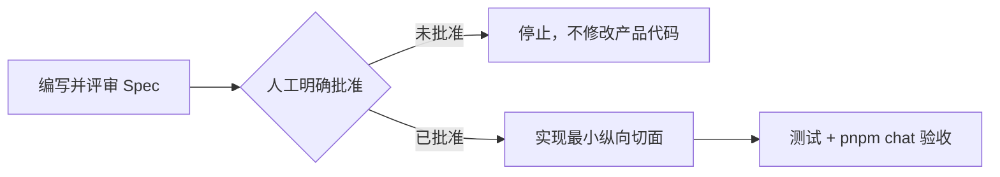
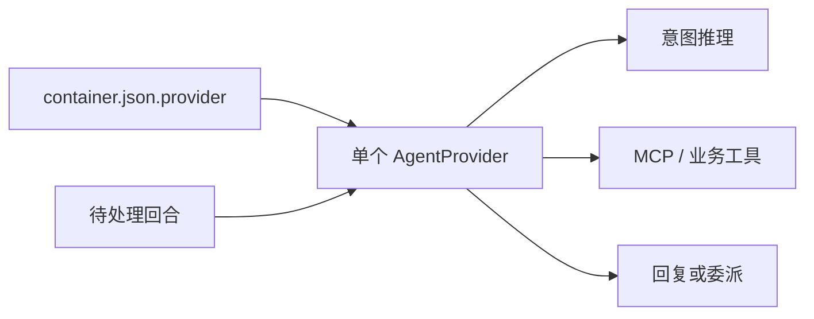
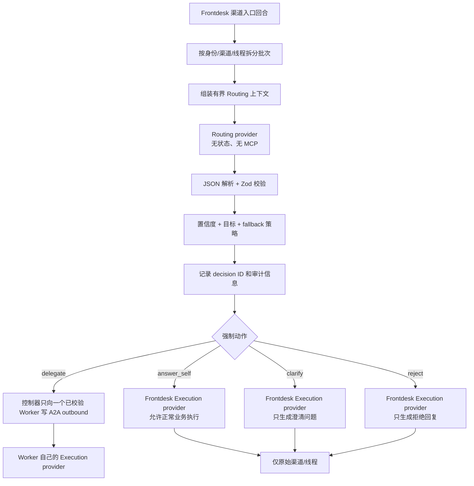
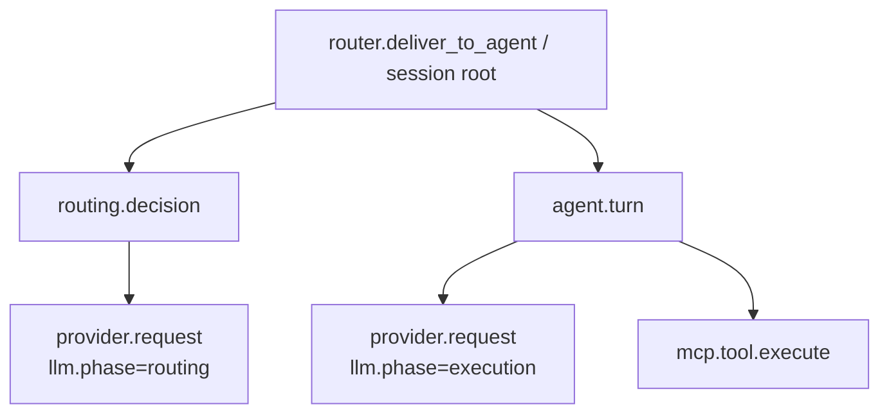

# Frontdesk 双 LLM Routing + Execution 规范

- **状态**：已批准并完成首个最小纵向切面
- **日期**：2026-07-19
- **范围**：仅 Frontdesk，强制拆分 Routing 与 Execution
- **实施授权**：用户已明确指示“批准 spec，开始编码”
- **团队工作语言**：中文；配置字段、代码标识符和协议枚举保持英文

## 1. 目标

将 Frontdesk 的一次用户回合拆为两个可独立配置的 LLM 阶段：

1. 轻量、无工具的 **Routing LLM** 识别当前用户意图。
2. Runner 校验结构化决策，并由确定性的控制器**强制执行**。
3. 独立的 **Execution LLM** 执行业务动作或生成用户可见回复。

当前本地验收配置为：

| 角色 | Provider | Adapter | Model |
|---|---|---|---|
| Routing | `opencode-go` | OpenAI-compatible Chat Completions | `mimo-v2.5` |
| Execution | `opencode-go` | OpenAI-compatible Chat Completions | `deepseek-v4-flash` |

两个角色复用现有 OpenCode Go endpoint 与凭据注入机制。凭据只能保存在环境变量或现有凭据代理中，不得写入本规范、`container.json`、Prompt、日志或源码。

当前连接目标是：

```text
https://opencode.ai/zen/go/v1/chat/completions
```

现有 base URL 归一化逻辑可以在内部保存 API root，但 Routing 和 Execution 的实际传输协议均为 Chat Completions。

## 2. 审批门禁

本规范是编码前必须落盘的设计交付物。实施流程为：



只有“批准 Spec，开始编码”等明确指令才能打开实施门禁。沉默、仅确认局部条款或继续提问均不构成编码授权。

当前门禁已经通过。

## 3. 已确认的产品决策

- Routing 是**强制控制**，不是建议。
- 新 Routing 阶段只应用于配置了该能力的 Frontdesk 渠道入口回合。
- Worker 的 A2A 回合不重复执行 Routing。
- Routing 不生成用户可见文本。
- `clarify`、`reject`、`answer_self` 的用户可见文本由 Frontdesk Execution LLM 生成。
- `delegate` 由控制器直接发送到选中的 Worker；Worker 自己的 provider 负责后续业务执行。
- Routing 不获得 MCP server 或业务工具。
- Routing 使用请求时读取的独立 Prompt 文件。
- Routing provider/model、超时、重试、置信度与 fallback 策略集中配置在 Frontdesk 的 `container.json`。
- 初始切面不做自动 reroute；Worker 的 `routing_feedback` / `nack` 仅记录。
- 未配置 Routing 时，现有 Claude 和单 provider 行为必须保持不变。
- 不修改依赖版本与 lockfile。

## 4. 现有架构

### 4.1 Host 入口路由是确定性的

`src/router.ts#routeInbound` 将渠道事件映射到 messaging group、接线关系、权限、session 和容器唤醒。它不做语义意图识别。


### 4.2 传统路径只创建一个 provider

Routing 功能关闭时，Runner 读取 `container.json.provider`，创建一个 provider 实例。该 provider 同时接收完整 Prompt、调用工具、选择目的地并生成最终回复。



### 4.3 `classify_intent` 是记录工具，不是路由控制器

传统 `classify_intent` MCP 工具由同一个 Execution 模型在完成意图推理后调用。它校验字段、写审计记录并返回建议，但不阻止后续投递。

因此，本功能不能只替换 `classify_intent` 背后的模型，必须在 Execution 之前增加新的编排阶段。

### 4.4 OpenAI-compatible 实现

项目使用自有 `OpenAIProvider` 和基于 `fetch` 的 Responses / Chat Completions 传输，不依赖 `ai` 或 `@ai-sdk/openai-compatible`。

本切面继续复用现有传输与现有 `zod` 依赖，不新增或升级 AI SDK。

## 5. 目标拓扑

### 5.1 Frontdesk 根回合



### 5.2 Worker 回合

`channel_type='agent'` 的 A2A 输入跳过 Routing，沿用 Worker 的单 provider 执行路径：


这样可以避免重复分类、路由循环以及每一跳都增加轻量模型成本。

## 6. 生效边界

只有同时满足以下条件才运行 Routing：

1. 当前 Agent Group 的 `container.json` 中 `llm.routing.enabled === true`。
2. 当前回合包含可触发的 `chat` 或 `chat-sdk` 消息。
3. 回合锚点来自渠道，而不是 `channel_type='agent'`。
4. 已通过 Host 现有的身份、权限和 engage 门禁。

以下情况保留原行为，不调用 Routing：

- Worker A2A 回合；
- 仅任务、仅 webhook、仅 system 的回合；
- `/clear` 和已有 Runner 命令处理；
- 未启用 `llm.routing` 的 Agent Group。

配置开关与渠道来源检查共同形成 Frontdesk-only 边界。普通 Worker 即使误配，也不能通过 A2A 输入进入 Routing。

## 7. 角色职责

### 7.1 Routing LLM

Routing 只能：

- 从闭合集合中选择一个动作；
- 在 `delegate` 时选择一个实时存在的 Agent 目的地；
- 返回置信度；
- 返回简短决策摘要。

Routing 不得：

- 调用 MCP 或业务工具；
- 访问 gateway memory；
- 读写业务文件；
- 发送消息；
- 生成用户可见回复；
- 虚构 Worker；
- 授权业务操作；
- 跨回合保存 continuation。

### 7.2 Routing 控制器

控制器是确定性应用代码，负责：

- Prompt 加载与 hash；
- 上下文组装与裁剪；
- 请求超时与重试；
- JSON 解析与 Zod 校验；
- 置信度策略；
- 实时目的地校验；
- fallback 合成；
- routing decision ID；
- 动作强制执行；
- 分类/审计记录；
- 分阶段 usage、日志与 Trace 属性。

最终路由权属于控制器，不属于任一模型。

### 7.3 Frontdesk Execution LLM

- `answer_self`：可使用现有 Frontdesk 业务工具并回复原始渠道，但本回合不得向 Agent 目的地委派。
- `clarify`：只生成简洁澄清问题，不得委派。
- `reject`：只生成简洁拒绝回复，不得委派。

控制器以系统上下文注入强制决策，和不可信用户文本分离。

### 7.4 Worker Execution LLM

对于 `delegate`，Frontdesk Execution provider 不被调用。控制器直接将完整的拆分后业务载荷发送给已校验 Worker。

Routing 的裁剪只影响轻量 Routing 请求，不得丢弃 Worker Execution 所需的业务上下文或附件。Worker provider 由 Worker 自己的配置决定。

## 8. Routing 协议

### 8.1 输出 Schema

```ts
type RoutingAction = 'delegate' | 'answer_self' | 'clarify' | 'reject';

interface RoutingDecisionV1 {
  action: RoutingAction;
  target?: string;
  confidence: number;
  reason: string;
}
```

运行时使用现有 `zod` 校验。未知字段被移除；必填字段和条件必填字段严格校验。

### 8.2 校验规则

- 去除首尾空白后必须是单个 JSON object。
- 可移除一个位于开头的 `<think>...</think>`；Markdown fence 和外围 prose 均无效。
- `action` 必须属于闭合枚举。
- `confidence` 必须为 `[0,1]` 范围内的有限数值。
- `reason` trim 后不能为空，最长 500 字符。
- `delegate` 必须包含非空 `target`，且目标能解析为当前 `type='agent'` 的目的地。
- 非 `delegate` 动作移除 `target`。
- 不接受模型提供的 Agent Group ID、User ID、Channel ID、权限结论或 provider 配置。
- 实时目的地表是目标解析的唯一权威来源。

### 8.3 控制器归一化记录

```ts
interface EnforcedRoutingDecision extends RoutingDecisionV1 {
  id: string;
  source: 'routing_llm' | 'fallback';
  provider: string;
  model: string;
  promptHash: string;
  attempts: number;
  fallbackReason?: RoutingFailureCode;
  targetAgentGroupId?: string; // 只能由代码解析
}
```

`reason` 与其他模型输出均属于不可信审计数据，不得用于授权、优先级或 gateway 输入。

## 9. 集中式 `container.json` 配置

### 9.1 Schema

```json
{
  "provider": "openai",
  "llm": {
    "routing": {
      "enabled": true,
      "provider": "opencode-go",
      "model": "mimo-v2.5",
      "transport": "chat-completions",
      "promptFile": "prompts/frontdesk-routing.md",
      "timeoutMs": 10000,
      "retryTimes": 1,
      "context": {
        "maxMessages": 4,
        "maxChars": 12000
      },
      "confidence": {
        "threshold": 0.7,
        "belowThresholdAction": "clarify"
      },
      "fallback": {
        "action": "clarify"
      }
    },
    "execution": {
      "provider": "opencode-go",
      "model": "deepseek-v4-flash",
      "transport": "chat-completions"
    }
  }
}
```

`opencode-go` 是现有 OpenAI-compatible adapter 的 provider registry alias，也是观测标签。JSON 中不得放置 API Key。

### 9.2 默认值与校验

| 字段 | 规则 |
|---|---|
| `llm.routing.enabled` | 缺失或 false 表示功能关闭 |
| `provider` | Routing 开启时必填，且必须已注册 |
| `model` | 必填且非空 |
| `transport` | 允许 `responses` 或 `chat-completions`；当前验收使用后者 |
| `promptFile` | 必填、相对路径、位于 `/workspace/agent/prompts` 内，不允许穿越 |
| `timeoutMs` | 整数 `1000..120000`，默认 `10000` |
| `retryTimes` | 额外完整尝试次数，整数 `0..3`，默认 `1` |
| `context.maxMessages` | 整数 `1..10`，默认 `4` |
| `context.maxChars` | 整数 `1000..50000`，默认 `12000` |
| `confidence.threshold` | `[0,1]`，默认 `0.70` |
| `belowThresholdAction` | 初始支持 `clarify` 或 `reject` |
| `fallback.action` | 初始支持 `clarify` 或 `reject`，禁止 `delegate` |

开启状态下的无效 Routing 配置必须让容器启动失败，并输出经过脱敏的错误。不得静默退回传统单模型路由。

### 9.3 Execution provider 解析优先级

```text
sessions.agent_provider
  -> agent_groups.agent_provider
  -> container.json llm.execution.provider
  -> legacy container.json provider
  -> claude
```

Routing provider 只来自 `llm.routing`，与 Execution 的 session/group override 独立。

当 override 选择了与 `llm.execution.provider` 不同的 provider 时，必须丢弃不兼容的 `llm.execution.model` 和 `transport`，使用覆盖后 provider 自己的默认解析逻辑，防止 OpenAI model 名泄漏给 Claude，或反向泄漏。

### 9.4 Provider contribution 合并

Host 必须对有效 provider 集合分别解析并合并挂载与环境贡献：

```text
{ routing provider, execution provider }
```

相同贡献可以去重；冲突的 env 或 mount 必须启动失败，禁止 last-write-wins。

OpenCode Go/OpenCode Go 会去重为同一 OpenAI-compatible 凭据贡献。混合 OpenAI-compatible/Claude 时必须同时准备两类凭据路径，且 continuation、Authorization header 和请求选项不得跨 provider 复用。

## 10. 动态 Routing Prompt

### 10.1 路径与加载

默认位置：

```text
/workspace/agent/prompts/frontdesk-routing.md
```

`llm.routing.promptFile` 相对 `/workspace/agent` 解析，并在每次 Routing 请求前读取。成功编辑后，下一个回合立即生效，不要求 watcher、数据库 Prompt 存储、管理 UI 或容器重启。

Host 源文件为：

```text
groups/<frontdesk-folder>/prompts/frontdesk-routing.md
```

Prompt 文件必须以嵌套只读挂载覆盖在通常可写的 Group Workspace 上，确保 Host/Operator 可更新，但 Execution 模型和容器工具不能改写可信策略。

### 10.2 安全规则

- 拒绝绝对路径和 `..` 穿越；
- 解析 symlink 后拒绝 `/workspace/agent` 外目标；
- 要求最终文件位于 Host 管理的只读 `/workspace/agent/prompts` 挂载内；
- 只读 UTF-8；
- 拒绝空 Prompt；
- 最大 64 KiB；
- 对成功读取的精确字节计算 `SHA-256`；
- 默认不记录完整 Prompt；
- 缺失、不可读、过大均进入配置的 fallback。

### 10.3 Prompt 所有权

Prompt 负责可动态调整的路由策略和 Worker 能力描述。控制器单独注入实时 Agent 目的地，因此 Prompt 不能让不存在的目标变为有效。

首个切面不提供 Prompt 历史或回滚 UI；Git/文件备份是版本历史，Prompt hash 用于运行时关联。“动态”指 Host/Operator 在请求时修改，不允许模型自修改。

## 11. Routing 上下文边界与组装

### 11.1 允许输入

Routing 只能接收：

1. 可信 Routing Prompt 文件；
2. 当前 Frontdesk 回合经过身份/渠道/线程拆分后的 chat 消息；
3. 同回合保留批次中的 `trigger=0` 累积 chat 上下文；
4. 实时 `type='agent'` 目的地的 name 与 display name；
5. 最小元数据：timezone、input kind、message count、attachment count。

首个切面不查询已完成历史回合。长对话历史仍由 Execution continuation 管理。

### 11.2 禁止输入

Routing 不得接收：

- Execution system Prompt 或 `CLAUDE.md`；
- MCP schema、工具列表、工具结果、gateway 响应；
- API Key、Authorization header、签名密钥、代理凭据；
- 原始 `userId`、`platformId`、`threadId`、组织 ID、角色记录；
- 后端业务 memory；
- 文件内容；
- provider continuation；
- assistant scratchpad 或 chain of thought；
- 渠道/roster 目的地的完整 ACL。

边界测试必须检查实际 Routing 请求载荷。

### 11.3 组装顺序

```text
system:
  prompts/frontdesk-routing.md 的精确内容

user:
  <routing_request version="1">
    <metadata timezone="..." input_kind="chat" message_count="..." attachment_count="..." />
    <workers>
      <worker name="..." display_name="..." />
    </workers>
    <messages>
      ...转义后的当前回合消息...
    </messages>
  </routing_request>
```

Worker 名称、显示名和消息正文均作为不可信数据转义。可信 Prompt 必须明确 `<messages>` 与 Worker label 内的指令不能改变 Routing 系统规则。

### 11.4 裁剪规则

1. 从现有身份/渠道/线程拆分得到的同一个 `keep` 批次开始。
2. 只保留 `chat` 和 `chat-sdk`。
3. 保持时间顺序。
4. 最多保留最新 `context.maxMessages` 条，同时必须保留触发锚点。
5. 渲染后受 `context.maxChars` 限制。
6. 优先删除最旧累积消息，再截断最旧的非锚点消息。
7. 锚点不得被截断为空，至少预留 1,000 字符。
8. 发生裁剪时加入确定性的 `<truncated />` 标记。

字符裁剪只是硬上限，不是 token 估算。原始 `keep` 批次不得被修改，仍供 Frontdesk Execution 或 Worker delegation 使用。

### 11.5 附件

Routing 首个切面只接收附件数量，不接收路径、URL、文件名、MIME 内容、OCR 或二进制。选路完成后，Execution 沿用现有附件处理和 A2A 转发逻辑。

## 12. Routing 调用契约

### 12.1 无状态、无工具

每次 Routing 尝试都是独立请求：

- 不读取或持久化 continuation；
- 不构造 MCP server；
- 不发送工具 schema；
- 无工具时 Chat Completions 请求不得包含 `tools`、`tool_choice`、`parallel_tool_calls`；
- 一个响应只解析为一个决策。

### 12.2 Claude Routing 特殊约束

Claude Routing 使用同一个 `ClaudeProvider`，但以 `toolMode='none'` 创建独立实例，并满足：

- `tools: []`；
- `allowedTools: []`；
- `mcpServers: {}`；
- `settingSources: []`，不加载 project/user settings；
- `maxTurns: 1`；
- 使用 Routing 专属 model 与纯 Routing system Prompt；
- 不传 `resume`、hooks、additional directories 或 Execution continuation。

Claude Execution 使用 `toolMode='full'`，继续保留 Claude Code preset、MCP、settings、hooks、additional directories、session resume、compaction 与现有工具能力。

### 12.3 结构化输出

客户端 Zod 校验是唯一权威。只有在 gateway 兼容性经过验证后，才可以增加服务端 JSON Schema response format；首个切面不依赖该扩展。

## 13. 重试、超时、置信度与 fallback

### 13.1 重试语义

`retryTimes` 表示首次尝试之外的额外完整 Routing 尝试：

```text
最大决策尝试次数 = 1 + retryTimes
```

可重试原因：

- timeout；
- network/transport failure；
- 可重试 HTTP status；
- 空响应；
- 无效 JSON；
- Schema 校验失败；
- 未知或非 Agent 的 delegate target。

每次尝试都重新读取 Prompt、重建实时 Worker 列表并计算 Prompt hash。

Routing provider 内部不得再隐藏一层固定重试；每个决策尝试只能对应一次上游传输尝试。Execution 保留既有 provider 重试逻辑。

### 13.2 超时

`timeoutMs` 独立应用于每一次 Routing 尝试，不消耗或修改 Execution timeout。

### 13.3 置信度

如果有效 `delegate` 的置信度低于阈值，控制器将其替换为 `belowThresholdAction`。归一化决策保留原置信度，并记录 `fallbackReason='low_confidence'`。

### 13.4 Fallback

所有尝试失败后，控制器合成安全决策：

```ts
{
  action: configuredFallbackAction,
  confidence: 0,
  reason: 'routing_unavailable',
  source: 'fallback',
  fallbackReason: '<bounded failure code>'
}
```

Fallback 只支持 `clarify` 或 `reject`，不得 `delegate`，也不得进入传统单模型路由。

有限失败码：

```text
timeout
transport_error
http_error
empty_output
invalid_json
schema_invalid
unknown_target
prompt_unavailable
low_confidence
```

自由文本错误只能以有长度上限的字段记录，不得作为 metric label。

## 14. 强制动作行为

### 14.1 `delegate`

- 用实时目的地表解析 `target`；
- 先写分类/审计 system row；
- 只向解析出的 Agent Group 写一个 A2A outbound；
- 沿用 Host 确立的 origin identity；
- 携带 routing decision ID；
- 发送完整拆分后业务载荷与附件引用；
- 不调用 Frontdesk Execution provider。

### 14.2 `answer_self`

- 使用完整现有 Execution 上下文调用 Frontdesk Execution provider；
- 注入控制器所有的动作上下文；
- 允许正常业务工具；
- 只允许回复原始渠道；
- 本回合拒绝 Agent 目的地发送。

### 14.3 `clarify`

- 调用 Execution 生成简洁澄清问题；
- 只允许原始渠道/平台/线程；
- 拒绝 Agent 目的地；
- 用户回复携带 decision ID 用于审计关联。

### 14.4 `reject`

- 调用 Execution 生成简洁拒绝；
- 只允许原始渠道；
- 拒绝 Agent 目的地。

### 14.5 跨进程强制门禁

Provider 位于 Runner 主进程，内置 MCP tools 位于子进程，因此仅靠 `poll-loop.ts` 内存变量不足以强制策略。

实现必须在容器所有的 `outbound.db` 中持久化每回合 Routing gate，并以 decision ID 与当前 inbound anchor 关联。以下路径读取同一 gate：

- 主进程最终 `<message to="...">` 分发；
- MCP 子进程 `send_message`、文件发送和 Agent 目的地路径；
- interactive card 等受支持的用户可见发送路径。

每个新 claimed turn 开始前必须清理崩溃残留 gate；回合结束后也必须清理。旧 anchor 的 gate 不得约束重放或其他回合。

分类日志仍然只用于观测，不得成为授权或路由输入。

## 15. 分类记录与 Worker 反馈

### 15.1 分类记录

启用 Routing 时，由控制器直接写分类记录，Execution 不再调用 `classify_intent`。

记录至少包含：

- `classificationId` = routing decision ID；
- `recommendedWorker` = 已校验 target；
- `confidence`；
- `reasoning` = 截断后的短 reason；
- `action_taken`；
- `decisionSource`；
- Routing provider/model；
- Prompt hash；
- attempts；
- fallback reason。

控制器 decision ID 必须覆盖模型可能提供的任何 classification ID。

### 15.2 传统 `classify_intent`

- Routing 关闭时保持不变；
- Routing-enabled Frontdesk 的 Execution 回合中隐藏或拒绝，以避免重复分类；
- 功能关闭时保留现有 Claude/单 provider Prompt 与行为。

### 15.3 Worker feedback

ADR-0040 继续生效：

- `routing_feedback` / `nack` 只记录；
- suggested target 不可信；
- 不自动 reroute；
- 不增加 Worker-to-Worker 转发循环。

## 16. Continuation 隔离

### 16.1 Routing

Routing 无状态，不读取、不写入 continuation。

### 16.2 Execution

Execution 保留现有 provider continuation，并明确由 Execution 角色所有：

```text
continuation:execution:<provider>
```

传统 `continuation:<provider>` 只迁移一次到 Execution key，不复制到 Routing。`/clear` 只清理当前 Execution continuation。

### 16.3 同 provider、不同 model

即使 Routing 与 Execution 都使用 `opencode-go` 或都使用 `claude`，也必须创建两个独立 provider 实例。model、timeout、transport、tool bridge、settings 和 continuation 都是实例/请求级配置，不得共享可变状态。

## 17. 可观测性

### 17.1 目标 Trace 结构

设计目标是在同一个 Host trace 下展示完整两阶段调用：



`provider.request` 保持统一 LLM span 名，通过 phase 属性区分角色。

目标属性包括：

- `openinference.span.kind`；
- `llm.phase`: `routing` / `execution`；
- `llm.system`；
- `llm.model_name`；
- `llm.transport`；
- prompt/completion/total token；
- cache read/write token；
- `llm.duration_ms`；
- `routing.decision_id`；
- `routing.action`；
- `routing.target`；
- `routing.confidence`；
- `routing.prompt_hash`；
- `routing.attempt`；
- `routing.fallback_reason`。

### 17.2 当前实现状态

当前实现已经具备：

- Execution `agent.turn` span；
- Execution `provider.request` LLM span；
- Execution span 上的 `llm.phase='execution'` 与 `routing.decision_id`；
- `llm.system`、`llm.model_name`、token、cache token、duration、transport；
- `OTEL_CAPTURE_CONTENT=true` 时的 LLM input/output 与 turn input/output；
- Routing/Execution 两阶段的 `llm-usage` 数据库记录；
- 完整 Routing 分类/审计 system row。

当前尚未完成：

- Routing 调用没有创建独立的 `provider.request` LLM span；
- 没有独立的 `routing.decision` / `routing.enforce` span；
- `routing.action`、confidence、prompt hash、attempt、fallback reason 尚未进入 Trace 属性；
- Routing 专属 Prometheus metrics 仍停留在设计阶段。

因此，当前可以通过 `outbound.db` 的 `llm-usage` 和分类记录完整区分两阶段，但 Phoenix/OTel Trace 只能直接看到 Execution LLM 子调用。后续观测增强必须补齐 Routing span，不能把当前 Trace 能力描述为已经完整实现。

### 17.3 Usage 记录

Routing：

```json
{
  "phase": "routing",
  "provider": "opencode-go",
  "model": "mimo-v2.5",
  "routingDecisionId": "route-...",
  "attempt": 1,
  "inputTokens": 424,
  "outputTokens": 414,
  "totalTokens": 838,
  "durationMs": 7682,
  "transport": "chat-completions"
}
```

Execution 使用 `phase: "execution"` 并携带相同 decision ID。该记录是当前本地验证双模型顺序的主要证据。

### 17.4 可分析维度

可从分类记录和 usage 挖掘：

- 按 phase/provider/model 的调用量、token、时延和失败率；
- 每个 decision ID 的 Routing → Execution 关联；
- Routing attempts 分布与重试恢复率；
- `routing_llm` 与 `fallback` 占比；
- action 分布：delegate / answer_self / clarify / reject；
- 低置信度与 fallback reason 分布；
- Prompt hash 版本效果对比；
- target/Worker 分布；
- 渠道、平台、线程维度的行为差异；
- 不同 provider/model 组合的成本与时延对比；
- Claude cache read/write token 与 OpenAI-compatible token 成本对比。

自由文本 user message、reason、Prompt 内容、API Key 不得成为高基数 metric label。

### 17.5 内容采集

内容采集由 ADR-0027 和 `OTEL_CAPTURE_CONTENT` 控制，默认关闭。开启后内容是明文，仅做 50,000 字符 exporter 安全截断，不是脱敏机制。

## 18. Claude 双角色兼容性

### 18.1 静态结论

在不具备可用 Claude API 的前提下，代码静态分析确认以下组合均可解析并创建独立实例：

- Claude Routing + Claude Execution；
- Claude Routing + OpenAI-compatible Execution；
- OpenAI-compatible Routing + Claude Execution；
- Routing 关闭时的传统 Claude 单 provider。

### 18.2 Claude Routing

Claude Routing 使用独立 `ClaudeProvider`，传入 Routing model、纯 Routing system Prompt、`toolMode='none'`，且无 MCP、无 settings、无 continuation、无 hooks、单 turn。

### 18.3 Claude Execution

Claude Execution 使用 `toolMode='full'`，保留：

- Claude Code preset system Prompt；
- project/user settings；
- MCP server；
- Bash/Read/Write/Edit 等现有工具；
- PreToolUse/PostToolUse/PreCompact hooks；
- additional directories；
- session resume 与 continuation；
- compaction 行为；
- Claude Agent SDK usage 聚合事件。

### 18.4 Claude Usage 特性

Claude Agent SDK 在 terminal result 上提供整回合聚合 usage。当前 `provider.request` 对 Claude 表示整回合聚合，而不是 SDK 内部每一次 Anthropic API 调用。可用维度包括：

- 聚合 model 名；
- input/output/total token；
- cache read token；
- cache creation token；
- `duration_api_ms` 或 `duration_ms`；
- transport=`claude-agent-sdk`。

### 18.5 静态验证边界

静态分析不能证明真实 Anthropic endpoint 的认证、模型可用性、SDK 响应字段漂移或线上 latency。上线前仍需使用有效 Claude 凭据执行至少一次 Routing 与 Execution smoke test。

自定义 `ANTHROPIC_BASE_URL` 还依赖 Host 侧 Claude contribution 注册和 OneCLI 配置；标准 Claude endpoint 与自定义 Anthropic-compatible endpoint 应分别验收。

## 19. 失败与安全边界

### 19.1 Fail-closed

- 无效启用配置导致启动失败；
- Routing 失败进入非委派 fallback；
- 未知目标不得进入 delivery；
- 低置信度不得绕过策略委派；
- Execution 不得改变控制器选择的目的地；
- 缺失 Prompt 不得回退到内嵌旧 Prompt。

### 19.2 身份与授权

- Host 身份解析和 A2A `origin_user_id` 传播保持不变；
- Routing 不向后端授权提供 requester identity；
- `reason`、target、confidence 均不是授权证据；
- Backend gateway 保持业务授权边界；
- 多租户组织检查仍在 Host 侧。

### 19.3 Prompt injection

- 用户文本以不可信数据分隔和转义；
- Routing 无工具、无副作用；
- 实时目的地由代码提供并二次校验；
- Prompt 不能扩大目的地 ACL；
- Execution 接收独立的控制器决策。

### 19.4 凭据

- 复用现有 `OPENAI_BASE_URL`、`OPENAI_API_KEY`、Claude/OneCLI 机制；
- 禁止将 Key 写入 `container.json` 或 Prompt；
- 禁止记录 Authorization header 或完整请求 header；
- 保留 OpenAI-via-OneCLI 凭据隔离能力。

## 20. 向后兼容

### 20.1 Routing 关闭

当 `llm.routing` 缺失或关闭时：

- 只创建一个 provider；
- 走原 poll loop；
- 保留传统 `classify_intent`；
- 保留 continuation 兼容迁移；
- 保留 Claude MCP、hooks、compaction、slash command 和权限行为；
- 不要求 Prompt 文件；
- Claude-only 部署不要求 OpenAI 环境变量。

### 20.2 OpenAI-compatible

- `openai`、`codex` alias 保持可用；
- `OPENAI_MODEL` 保持传统 fallback；
- Responses → Chat Completions fallback 保持不变；
- `opencode-go` 是增量 alias。

### 20.3 依赖清单

不得修改依赖版本。验收必须证明以下文件的依赖和 lock 内容没有变化：

- `package.json`；
- `container/agent-runner/package.json`；
- `pnpm-lock.yaml`。

## 21. 测试计划

### 21.1 单元测试

- Host/Runner 解析相同 `llm` 配置；
- 默认值、范围、无效配置失败；
- provider 优先级；
- contribution 去重与冲突失败；
- Prompt 路径、symlink、大小、空文件、缺失与 hash；
- 上下文只包含允许字段；
- 上下文排除 ID、工具、memory、凭据和文件内容；
- 裁剪保持顺序与锚点；
- 四种 action 的 Schema；
- 拒绝 fence/prose、无效 confidence/reason/target；
- 重试次数严格为 `1 + retryTimes`；
- timeout/failure code 进入 fallback；
- 低置信度 delegate 被强制降级；
- Routing 无 MCP、无 continuation；
- Routing/Execution 使用独立实例与 model；
- Claude tool-free Routing 与 full-tool Execution options；
- Execution continuation 迁移。

### 21.2 强制门禁测试

- `delegate` 只产生一个 Worker outbound，不调用 Frontdesk Execution；
- `answer_self` / `clarify` / `reject` 调用 Execution 并阻止 Agent 目的地；
- 最终 XML、MCP message/file、interactive card 均不能绕过 gate；
- 旧 anchor gate 不得复用；
- Worker A2A 跳过 Routing；
- Worker feedback 不触发 reroute。

### 21.3 观测测试

- Routing/Execution usage 携带正确 phase/provider/model；
- 两阶段共享 decision ID；
- Prompt 修改后 hash 变化；
- retry/fallback 元数据存在；
- `OTEL_CAPTURE_CONTENT` 关闭时无内容；
- metric labels 有界；
- 后续补充 Routing LLM span 与 Execution LLM span 的父子/关联测试。

### 21.4 回归测试

- Host 测试；
- Container Runner 测试；
- OpenAI provider 测试；
- Claude provider 测试；
- Agent eval；
- Legacy mock roundtrip；
- 无 OpenAI 变量的 Claude-only 启动校验。

### 21.5 本地验收

```bash
pnpm chat "hello"
```

验收要求：

1. 收到成功的用户可见回复；
2. 同一 decision ID 的记录顺序为：

   ```text
   routing:   opencode-go / mimo-v2.5
   execution: opencode-go / deepseek-v4-flash
   ```

3. 使用确定性 integration/eval fixture 验证 `delegate` 直接分发且不可覆盖；
4. 依赖与 lockfile 不变。

`hello` 验证 `answer_self` 双调用路径；确定性 fixture 验证 `delegate` 控制路径。

## 22. 实现映射

| 区域 | 职责 |
|---|---|
| `src/container-config.ts` | Host 配置类型和归一化 |
| `src/container-runner.ts` | 双 provider 解析、contribution 合并、Prompt 只读挂载 |
| `src/providers/openai.ts` | `opencode-go` Host alias |
| `container/agent-runner/src/config.ts` | Runner 配置校验 |
| `container/agent-runner/src/index.ts` | 创建独立 Routing/Execution provider |
| `container/agent-runner/src/provider-roles.ts` | 角色解析与 provider-specific override |
| `container/agent-runner/src/providers/claude.ts` | Claude tool-free/full-tool 角色参数 |
| `container/agent-runner/src/providers/openai.ts` | 实例级 model/timeout/transport 与无工具调用 |
| `container/agent-runner/src/routing/*` | Prompt、上下文、Schema、策略、控制器、gate |
| `container/agent-runner/src/poll-loop.ts` | Routing 编排、Execution、usage 与 Trace |
| `container/agent-runner/src/mcp-tools/*` | 共享 routing gate |
| `container/agent-runner/src/db/session-state.ts` | continuation 与 gate 持久化 |
| `docs/configuration-reference.md` | 配置说明 |
| `docs/decisions/ADR-0054-*.md` | 架构决策 |

## 23. 发布阶段

### Phase 0：基线

- 记录 manifest/lock hash；
- 运行 provider/config 基线测试；
- 保留已有未提交变更。

### Phase 1：Spec 审批

- 评审本规范；
- 只修改文档；
- 等待明确批准。

### Phase 2：默认关闭实现

- 增加配置、控制器和测试；
- `llm.routing.enabled` 默认 false；
- 写入 ADR。

### Phase 3：本地 Frontdesk 激活

- 增加 Routing Prompt；
- 启用本地 Routing；
- 凭据保存在环境变量；
- Execution 使用 `deepseek-v4-flash`。

### Phase 4：验证

- 运行相关测试；
- 执行 `pnpm chat "hello"`；
- 保存 phase/model/order 证据；
- 静态验证 Claude，并在凭据可用后补 smoke test；
- 验证依赖未变化。

本目标不包含生产或 Feishu/Lark 发布。

## 24. 明确非目标

- Prompt 数据库或远程 Prompt 服务；
- Prompt 管理 UI、历史 UI、A/B test、灰度百分比；
- 自动 reroute 或 Worker-to-Worker routing；
- Worker 回合 Routing；
- 查询已完成的完整历史对话；
- Routing 访问工具、gateway memory、附件正文或业务数据；
- 新增 LLM SDK；
- 依赖升级；
- Feishu/Lark 集成测试；
- 本切面内完成 provider 成本优化、缓存、批处理或投机路由；
- 超出最小本地切面的模型质量 benchmark。

## 25. 审批清单

- [x] 强制、Frontdesk-only 控制流正确。
- [x] `delegate` 绕过 Frontdesk Execution，直接调用 Worker。
- [x] `answer_self`、`clarify`、`reject` 使用 Frontdesk Execution 生成用户文本。
- [x] 上下文边界、组装与裁剪可接受。
- [x] Prompt 请求时加载、只读挂载与 hash 行为可接受。
- [x] `container.json` Schema 与 provider 优先级可接受。
- [x] retry、timeout、低置信度与 fallback 语义可接受。
- [x] 跨进程 routing gate 足以约束受支持的模型/工具发送面。
- [x] Routing 无状态与 Execution continuation 隔离可接受。
- [x] Claude 双角色静态兼容路径可接受，待有效凭据补 live smoke test。
- [x] `llm-usage` 足以完成当前 `pnpm chat` 验收。
- [ ] Routing LLM span 尚需补齐，当前 Phoenix Trace 不能完整显示两段 LLM 调用。
- [x] 向后兼容与非目标可接受。

上述产品条款已经获批；首个最小纵向切面已经实现。
